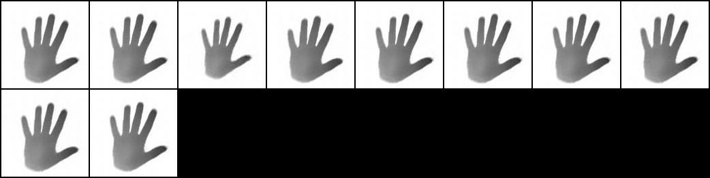
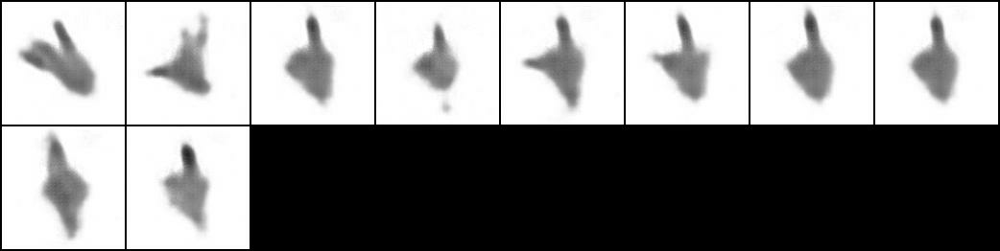
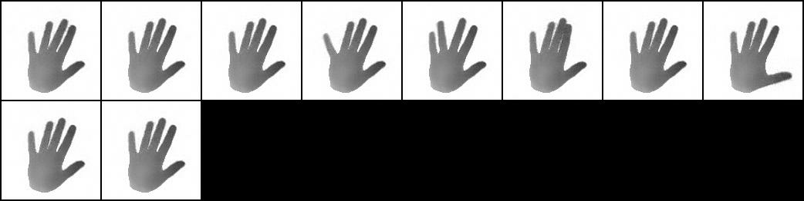

# HandPoseShapeVAE

(not actively maintained)

Experimental framework for unsupervised hand pose and shape disentanglement

Thanks to
- https://github.com/moberweger/deep-prior-pp
- https://github.com/rtqichen/beta-tcvae
- https://github.com/Knight13/beta-VAE-disentanglement
- https://github.com/AntixK/PyTorch-VAE


## Getting Started

These instructions will get you a copy of the project up and running on your local machine for development and testing purposes. See deployment for notes on how to deploy the project on a live system.

### Prerequisites

What things you need to install the software and how to install them

- [PyTorch 1.1](https://pytorch.org/)
- [CUDA 10](https://developer.nvidia.com/cuda-downloads)
- [TensorboardX](https://github.com/lanpa/tensorboardX)
- [2015 MSRA Hand Gesture Dataset](https://jimmysuen.github.io/)


### Setup

(In the following, the working directory should be the same location as this readme file)

Create the following directories:
```txt
../data/preprocessed
../models
```

Download/Save dataset as

```txt
../data/MSRA15/P0
...
../data/MSRA15/P8
```

## Preprocess

Import sequences into rendered format

```txt
preprocess/import_msra.py --input-dataset "../data/MSRA15" --label-name "msra"
```

Merge rendered sequences

```txt
preprocess/merge_rendered.py
```

Split dataset into train, validation and test datasets

```txt
preprocess/preprocess_rendered.py --input-dataset "../data/msra_merged.npz" --label-name "msra_merged" --random
```

## Train

```txt
main.py --basename "HandPoseShapeVAE_MSRA" --model "bvae" --auto-load --auto-save --beta 15.0 --train --train-dir "../data/preprocessed/train_msra_merged.npz" --validation-dir "../data/preprocessed/validate_msra_merged.npz" --test-dir "../data/preprocessed/test_msra_merged.npz"
```

## Test

```txt
main.py --basename "HandPoseShapeVAE_MSRA" --model "bvae" --auto-load --auto-save --beta 15.0 --test --train-dir "../data/preprocessed/train_msra_merged.npz" --validation-dir "../data/preprocessed/validate_msra_merged.npz" --test-dir "../data/preprocessed/test_msra_merged.npz"
```

## Experiments

```txt
main.py --basename "HandPoseShapeVAE_MSRA" --model "bvae" --auto-load --auto-save --beta 15.0 --experiments --traverse-latents --train-dir "../data/preprocessed/train_msra_merged.npz" --validation-dir "../data/preprocessed/validate_msra_merged.npz" --test-dir "../data/preprocessed/test_msra_merged.npz"
```

```txt
main.py --basename "HandPoseShapeVAE_MSRA" --model "bvae" --auto-load --auto-save --beta 15.0 --experiments --train-joints --train-dir "../data/preprocessed/train_msra_merged.npz" --validation-dir "../data/preprocessed/validate_msra_merged.npz" --test-dir "../data/preprocessed/test_msra_merged.npz"
```




